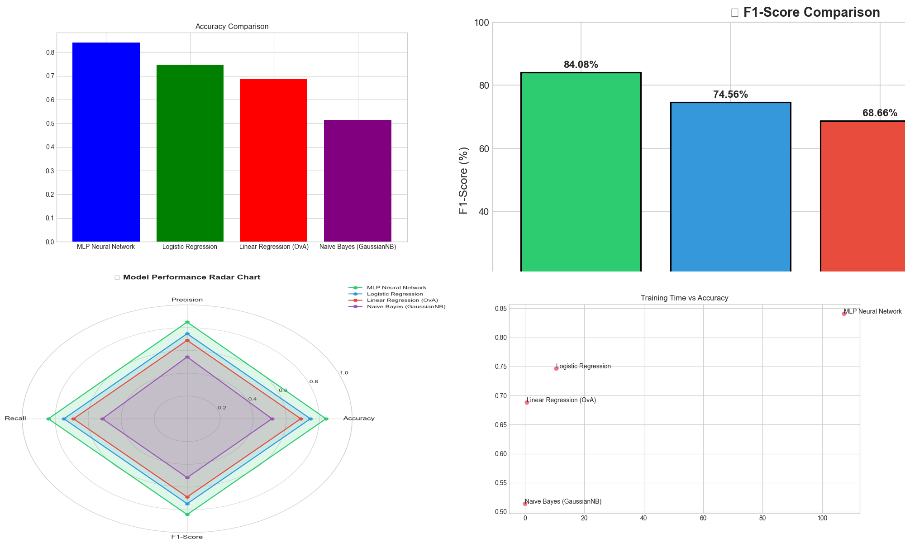

# Handwritten Digit Recognition Project Report

## 1. Executive Summary
This project aims to implement and compare various machine learning models for the task of handwritten digit recognition using the MNIST dataset. We evaluated four different approaches: Multi-Layer Perceptron (MLP), Logistic Regression, Linear Regression (One-vs-All), and Naive Bayes. The MLP Neural Network achieved the highest accuracy, while Naive Bayes was the most computationally efficient.

## 2. Dataset and Preprocessing
The dataset used for this project is a subset of the MNIST handwritten digits dataset.
- **Samples**: 7,000 images (5,000 training, 2,000 testing)
- **Features**: Each image is 28x28 pixels, flattened into a 784-dimensional vector.
- **Preprocessing**: 
  - Normalization: Pixel values were scaled to the [0, 1] range.
  - Data Splitting: Stratified splitting to maintain class balance.

## 3. Model Architectures
### 3.1 Multi-Layer Perceptron (MLP)
A feed-forward neural network with:
- Input layer: 784 neurons
- Hidden layers: 100 neurons (ReLU activation)
- Output layer: 10 neurons
- Optimizer: Adam
- Max Iterations: 500

### 3.2 Logistic Regression
- Regularization: L2 (Ridge)
- Multi-class strategy: Multinomial
- Solver: lbfgs

### 3.3 Linear Regression (OvA)
- One-vs-All implementation using Ridge Regression.
- Final prediction based on the highest score among all classifiers.

### 3.4 Naive Bayes
- Variant: Gaussian Naive Bayes
- Assumes pixel independence within each class.

## 4. Performance Comparison
The models were evaluated based on several metrics including Accuracy, Precision, Recall, and F1-Score.

| Model | Accuracy | F1-Score | Training Time (s) |
|-------|----------|----------|-------------------|
| MLP Neural Network | 84.10% | 0.8408 | 107.29 |
| Logistic Regression | 74.70% | 0.7456 | 10.57 |
| Linear Regression (OvA) | 68.85% | 0.6866 | 0.67 |
| Naive Bayes (GaussianNB) | 51.40% | 0.5165 | 0.05 |

### Consolidated Visualization

## 5. Key Findings
- **Superiority of MLP**: The MLP model consistently outperformed others, demonstrating the importance of non-linear transformations for image data.
- **Efficiency of Naive Bayes**: While it had the lowest accuracy (51.4%), Naive Bayes trained almost instantly, making it a good baseline for very large datasets or low-resource environments.
- **Linear Baseline**: Logistic regression provided a solid baseline of ~75% accuracy, significantly better than the basic linear regression approach.

## 6. Failure Analysis
Most misclassifications occurred between visually similar digits:
- Digit **4** mistaken for **9** (long stalks).
- Digit **5** mistaken for **3** (rounded bottoms).
- Digit **7** mistaken for **2** (similar top curvature).

The MLP model showed more robustness but still struggled with highly distorted or ambiguously written digits.

## 7. Conclusion and Future Work
We successfully implemented a comparative framework for digit recognition. For production-quality performance, the MLP approach is highly recommended. Future work could involve:
1. Implementing **Convolutional Neural Networks (CNNs)** which are specifically designed for spatial feature extraction.
2. **Data Augmentation** to improve model robustness to rotations and scaling.
3. **Hyperparameter optimization** using GridSearch or Bayesian methods.
